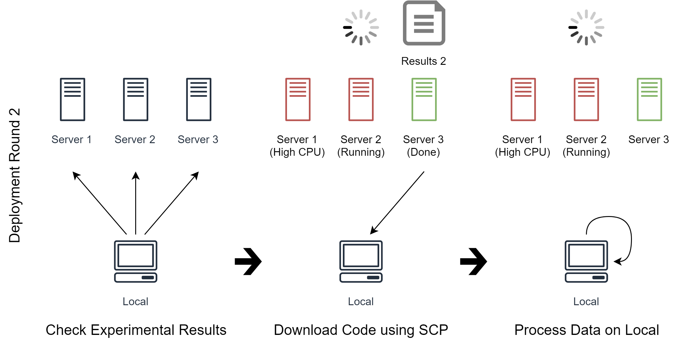

# Training Noodles

A simple and powerful tool to help training **multiple** programs on **multiple** servers with only one human.

## Features

* Automatically deploys experiments to available servers
* No need to change any existing code
* Considers CPU usage, GPU usage, memory usage, disk usage, and more
* Uses only SSH protocol
* Relies on minimal dependencies
* Allows fast prototyping

## Use Case

If we want to run 4 experiments on 3 servers, more specifically, we need to

1. Upload the code to one of the servers which has low CPU usage
2. Run the code on the server
3. Download experimental results when they're ready


In the first deployment round (See image above), Noodles will use the user-defined commands to check CPU usage on the servers.

The CPU usage is high on *Server 1*, so Noodles uses `scp` to upload the code and run them on *Server 2* and *Server 3*.

As for how to upload the code, it's just a list of commands written by us, Noodles just follows the commands.



In the second deployment round (See image above), we tell Noodles to check experimental results on all servers.

Noodles finds that *Server 3* has just finished running *Code 2*, so it downloads the experimental results and process the data on local machine as we tell it to do so.


In the third deployment round (See image above), Noodles continues to check CPU usage, upload the code and run the code because *Code 3* and *Code 4* have the same CPU usage requirements and the same commands as *Code 1* and *Code 2* (but different code to upload).

The deployment round would continue until all experiments are successfully deployed.

## How Noodles Works

1. Initialize the list of experiments in **E**
1. For each deployment round
    1. Initialize the list of servers in **S**
    2. For each experiment in **E**
        1. Noodles runs user-defined requirements on each server in **S**
        2. Noodles compares the metrics (results from the above step) to the user-defined expression
        3. If the expression is satisfied, Noodles runs the user-defined commands on the satisfied server
        4. Remove the current experiment from **E**
        5. Remove the satisfied server from **S**
        6. If **S** is empty, break
    3. If **E** is empty, break

The implementation of Noodles complies with the following rules:

1. Simple (User can understand code and spec without looking documentation)
2. Easy to debug (Noodles can take different actions when different error occurs)
3. Stateless (The only state Noodles cares about is whether the deployment is successful or not, the states of the experiments must be handled by the user)

## Prerequisites

1. Linux-based terminals (For Windows, I recommend using [git-sdk](https://github.com/git-for-windows/build-extra/releases))
2. Python 3.5 or higher

## Installation

Run the following command:

```bash
pip install -e .
```

## Usage

```bash
noodles <command_type> <path_to_spec>
```

It's just that simple.

## Examples

Here are some examples showing how Noodles is used:

```bash
noodles run my_training.yml
noodles status my_training.yml
noodles monitor my_training.yml
noodles stop my_training.yml
noodles download my_training.yml
noodles upload my_training.yml
...
```

You can also choose only some experiments:

```bash
noodles run "my_training.yml:Experiment 1,Experiment 2"
```

See the example [Two Locals](examples/two_locals) to get started. See [Train TensorFlow Examples](examples/train_tensorflow_examples) for a more complex example.

## Default Spec

Noodles will use properties from default spec if the user spec doesn't specify them. See [training_noodles/specs/defaults.yml](training_noodles/specs/defaults.yml) for the default spec.
